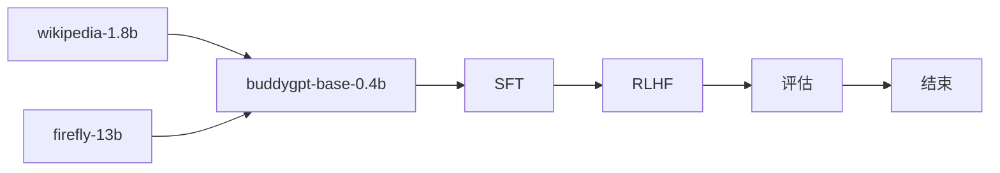

## buddygpt

> *train llm from scratch especially for the chinese language*
> with RoPE, GQA, SWiGLU, RMSNorm, weight-tying, FLASH-ATTENTION

|model|Rope|Q-head|KV-head|n_embed|n_layer|seq_len|
|-|-|-|-|-|-|-|
|buddygpt-0.4b|✅|16|8|1024|16|1024|
|buddygpt-4b|✅|32|16|2048|24|1024|

## implementation

## code structure

- model: the model structure code
- pretrain: pretrain workflow
- sft: finetune workflow
- rlhf: rlhf with DPO https://arxiv.org/pdf/2305.18290
- eval: evaluate tool with [lm-eval](https://github.com/EleutherAI/lm-evaluation-harness)

## script

- pretrain: `cd pretrain && accelerate launch --config_file ptrain.yaml --num_processes=1 pretrain.py`
- eval: `cd eval && python eval.py`

