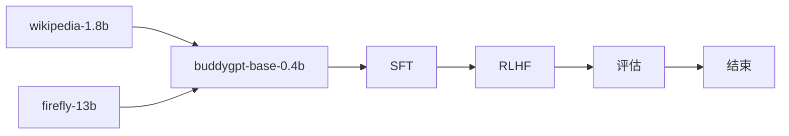

## buddygpt

> *train llm from scratch especially for the chinese language*
> with RoPE, GQA, SWiGLU, RMSNorm, weight-tying, FLASH-ATTENTION

|model|Tied Embedding|RoPE|Q-head|KV-head|n_embed|n_layer|seq_len|
|-|-|-|-|-|-|-|-|
|buddygpt-0.2b|✅|✅|16|8|1024|16|1024|
|buddygpt-0.4b|❌|✅|16|8|1024|16|1024|
|buddygpt-4b|❌|✅|32|16|2048|24|1024|

## metrics

|model|cmmlu|gpqa|ifeval|aime24|math-500|livecodebench|
|-|-|-|-|-|-|-|
|buddy-0.4b-base-zh|**25.26**|0.1|0.1|0.1|0.1|0.1|
|deepseek-v3|**88.8**|59.1|**86.1**|39.2|**90.2**|37.6|
|qwen3-0.6b|-|26.77|-|-|32.44|-|

## implementation



## code structure

- model: the model structure code
- pretrain: pretrain workflow
- sft: finetune workflow
- rlhf: rlhf with DPO https://arxiv.org/pdf/2305.18290
- eval: evaluate tool with [lm-eval](https://github.com/EleutherAI/lm-evaluation-harness)

## script

- pretrain: 
```
cd pretrain && accelerate launch --config_file ptrain.yaml --num_processes=1 pretrain.py
```
- eval: 
```shell
export PYTHONPATH=$(pwd):$PYTHONPATH
lm_eval --model hf \
    --model_args pretrained=learn2pro/buddygpt-0.4b-base-zh,dtype="bfloat16" \
    --tasks cmmlu,gpqa \
    --device cuda:0 \
    --batch_size 8

lm_eval --model hf \
    --model_args pretrained=qwen/qwen3-0.6b,dtype="bfloat16" \
    --tasks cmmlu \
    --device cuda:0 \
    --batch_size 32

all_proxy= evalscope eval \
 --model outputs/buddygpt-qwen3 \
 --model-args precision=torch.bfloat16,device_map=auto \
 --datasets cmmlu

all_proxy= evalscope eval \
 --model outputs/checkpoint-22614 \
 --datasets cmmlu \
 --limit 10
```

- push_to_hub:
```
huggingface-cli login
huggingface-cli repo create buddygpt-0.4b-base-zh --type model
```


