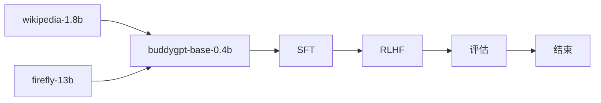

## buddygpt

> *train llm from scratch especially for the chinese language*
> with RoPE, GQA, SWiGLU, RMSNorm, weight-tying, FLASH-ATTENTION

|model|Tied Embedding|RoPE|Q-head|KV-head|n_embed|n_layer|seq_len|
|-|-|-|-|-|-|-|-|
|buddygpt-0.2b|✅|✅|16|8|1024|16|1024|
|buddygpt-0.4b|❌|✅|16|8|1024|16|1024|
|buddygpt-4b|❌|✅|32|16|2048|24|1024|

## metrics

|model|cmmlu|gpqa|ifeval|aime24|math-500|livecodebench|
|-|-|-|-|-|-|-|
|buddygpt-0.4b-base-zh|**25.26**|0.1|0.1|0.1|0.1|0.1|
|deepseek-v3|**88.8**|59.1|**86.1**|39.2|**90.2**|37.6|
|qwen3-0.6b|26.77|-|-|-|32.44|-|

## implementation



## pretrain

本次训练的预训练预料都来自[Hugging Face](https://huggingface.co/)，主要包含以下几个经典的中文数据集，大约有35B左右Token，详细数据集如下：

| 中文预训练语料    | 链接                                                         | 描述                                            |
| ----------------- | ------------------------------------------------------------ | ----------------------------------------------- |
| Wiki中文百科      | [wikipedia](https://huggingface.co/datasets/pleisto/wikipedia-cn-20230720-filtered) | 中文Wikipedia的数据                             |
| BaiduBaiKe        | [baidubaike](https://huggingface.co/datasets/xuqinyang/BaiduBaike-5.63M) | 中文BaiduBaiKe的数据                            |
| zhihu             | [zhihu](https://huggingface.co/datasets/wangrui6/Zhihu-KOL)  | 知乎KOL中截取的数据                             |
| 网络小说      | [webnovel](https://huggingface.co/datasets/wdndev/webnovel-chinese) | 个人爬虫数据清洗的数据                             |
| TigerBot 部分数据 | [tigerBot](https://huggingface.co/datasets/TigerResearch/pretrain_zh) | TigerBot 模型训练的部分中文数据，原始数据太多了 |
|                   |                                                              |                                                 |

## SFT

SFT指令微调预料都来自[Hugging Face](https://huggingface.co/)，主要包含以下几个经典的SFT数据集，大约有400w条，详细数据集如下：

| SFT微调数据 | 链接                                                         | 描述                                       |
| ----------- | ------------------------------------------------------------ | ------------------------------------------ |
| Belle       | [Belle](https://huggingface.co/datasets/BelleGroup/train_2M_CN) | 包含约200万条由BELLE项目生成的中文指令数据 |
| Firefly     | [Firefly](https://huggingface.co/datasets/YeungNLP/firefly-train-1.1M) | 流萤开源模型SFT数据集                      |
| TigerBot    | [tigerBot](https://huggingface.co/datasets/TigerResearch/sft_zh) | TigerBot 模型SFT数据集                     |
|             |                                                              |                                            |

## code structure

- model: the model structure code
- pretrain: pretrain workflow
- sft: finetune workflow
- rlhf: rlhf with DPO https://arxiv.org/pdf/2305.18290
- eval: evaluate tool with [lm-eval](https://github.com/EleutherAI/lm-evaluation-harness)

## script

- pretrain: 
```
cd pretrain && accelerate launch --config_file ptrain.yaml --num_processes=1 pretrain.py
```
- eval: 
```shell
export PYTHONPATH=$(pwd):$PYTHONPATH
lm_eval --model hf \
    --model_args pretrained=learn2pro/buddygpt-0.4b-base-zh,dtype="bfloat16" \
    --tasks cmmlu,gpqa \
    --device cuda:0 \
    --batch_size 8 \
    --num_fewshot 2 \
    --output_path results/cmmlu_2shot_log \
    --log_samples

lm_eval --model hf \
    --model_args pretrained=learn2pro/buddygpt-0.4b-base-zh,dtype="bfloat16" \
    --tasks cmmlu \
    --device cuda:0 \
    --batch_size 8 \
    --num_fewshot 2 \
    --output_path results/cmmlu_2shot_log \
    --log_samples


lm_eval --model hf \
    --model_args pretrained=outputs/buddysft-qwen3,dtype="bfloat16" \
    --tasks cmmlu \
    --device cuda:0 \
    --batch_size 8

lm_eval --model hf \
    --model_args pretrained=qwen/qwen3-0.6b,dtype="bfloat16" \
    --tasks cmmlu \
    --device cuda:0 \
    --batch_size 32

all_proxy= evalscope eval \
 --model outputs/buddygpt-qwen3 \
 --model-args precision=torch.bfloat16,device_map=auto \
 --datasets cmmlu

all_proxy= evalscope eval \
 --model outputs/checkpoint-22614 \
 --datasets cmmlu \
 --limit 10
```

- push_to_hub:
```
huggingface-cli login
huggingface-cli repo create buddygpt-0.2b-base-zh --type model
huggingface-cli upload learn2pro/buddygpt-0.2b-base-zh outputs/buddygpt-qwen3
```


