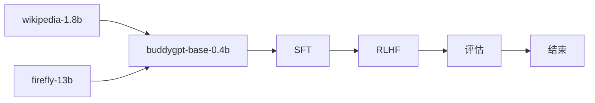
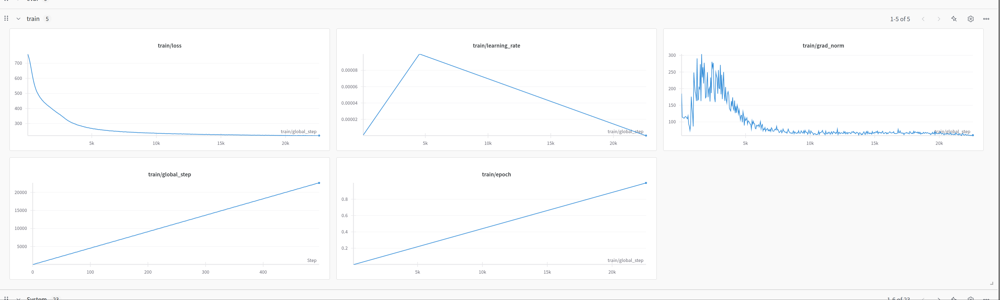

## buddygpt

> *train llm from scratch especially for the chinese language*
> with RoPE, GQA, SWiGLU, RMSNorm, weight-tying, FLASH-ATTENTION

|model|Rope|Q-head|KV-head|n_embed|n_layer|seq_len|
|-|-|-|-|-|-|-|
|buddygpt-0.4b|✅|16|8|1024|16|1024|
|buddygpt-4b|✅|32|16|2048|24|1024|

## performance

|model|cmmlu|gpqa|ifeval|aime24|math-500|livecodebench|
|-|-|-|-|-|-|-|
|buddygpt-0.4b-base-zh|**25.26**|0.1|0.1|0.1|0.1|0.1|
|deepseek-v3|**88.8**|59.1|**86.1**|39.2|**90.2**|37.6|
|qwen3-0.6b|-|41.77|-|-|32.44|-|

- buddygpt-0.4b-base-zh

|Groups|Version|Filter|n-shot| Metric |   |Value |   |Stderr|
|------|------:|------|------|--------|---|-----:|---|-----:|
|cmmlu |      1|none  |      |acc     |↑  |0.2526|±  | 0.004|
|      |       |none  |      |acc_norm|↑  |0.2526|±  | 0.004|

## implementation


## pretrain stage

[wandb](https://wandb.ai/druidlangde-tencent/huggingface/runs/8ffkcdb5?nw=nwuserdruidlangde)


## code structure

- model: the model structure code
- pretrain: pretrain workflow
- sft: finetune workflow
- rlhf: rlhf with DPO https://arxiv.org/pdf/2305.18290
- eval: evaluate tool with [lm-eval](https://github.com/EleutherAI/lm-evaluation-harness)

## script

- pretrain: `cd pretrain && accelerate launch --config_file ptrain.yaml --num_processes=1 pretrain.py`
- eval: `cd eval && python eval.py`


```shell
export PYTHONPATH=$(pwd):$PYTHONPATH
lm_eval --model hf \
    --model_args pretrained=learn2pro/buddygpt-0.4b-base-zh,dtype="bfloat16" \
    --tasks cmmlu \
    --device cuda:0 \
    --batch_size 32

lm_eval --model hf \
    --model_args pretrained=qwen/qwen3-0.6b,dtype="bfloat16" \
    --tasks cmmlu \
    --device cuda:0 \
    --batch_size 32
```