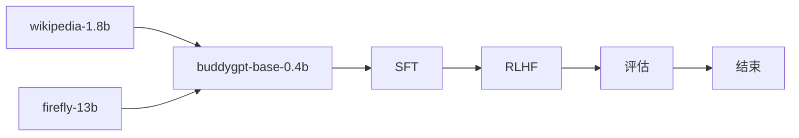

## buddygpt

> *train llm from scratch especially for the chinese language*
> with RoPE, GQA, SWiGLU, RMSNorm, weight-tying, FLASH-ATTENTION

|model|Tied Embedding|RoPE|MLA|MOE|Q-head|KV-head|n_embed|n_layer|seq_len|batch_size(token)|loss|
|-|-|-|-|-|-|-|-|-|-|
|buddygpt-0.1b|✅|✅|❌|❌|16|8|768|8|1024|20*64k|3.5766|
|buddygpt-0.3b|✅|✅|❌|❌|16|8|1024|24|1024|20*64k|-|
|buddygpt-0.7b|✅|✅|✅(q_lora=16,q_rope=24,q_nope=72,v_dim=96)|✅(n_expert=12,share=2,activate=2)|16|-|**1536**|**24**|1024|**2*1024k**|-|

```
0.7b
BuddyGPTForCausalLM(
  (model): BuddyGPTModel(
    (embed_tokens): Embedding(151669, 1536)
    (layers): ModuleList(
      (0-23): 24 x DecoderLayer(
        (self_attn): SdpaAttention(
          (q_proj): Linear(in_features=1536, out_features=1536, bias=True)
          (k_proj): Linear(in_features=1536, out_features=768, bias=True)
          (v_proj): Linear(in_features=1536, out_features=768, bias=True)
          (o_proj): Linear(in_features=1536, out_features=1536, bias=False)
          (rotary_emb): RotaryEmbedding()
        )
        (mlp): MOELayer(
          (gate): MOEGate()
          (experts): ModuleList(
            (0-11): 12 x GateMLP(
              (gate_proj): Linear(in_features=1536, out_features=256, bias=False)
              (up_proj): Linear(in_features=1536, out_features=256, bias=False)
              (down_proj): Linear(in_features=256, out_features=1536, bias=False)
              (act_fn): SiLU()
            )
          )
          (shared_experts): GateMLP(
            (gate_proj): Linear(in_features=1536, out_features=512, bias=False)
            (up_proj): Linear(in_features=1536, out_features=512, bias=False)
            (down_proj): Linear(in_features=512, out_features=1536, bias=False)
            (act_fn): SiLU()
          )
        )
        (input_layernorm): RMSNorm((1536,), eps=1e-06, elementwise_affine=True)
        (post_layernorm): RMSNorm((1536,), eps=1e-06, elementwise_affine=True)
      )
    )
    (norm): RMSNorm((1536,), eps=1e-06, elementwise_affine=True)
  )
  (lm_head): Linear(in_features=1536, out_features=151669, bias=False)
)
```

## implementation



## pretrain
#### dataset
本次训练的预训练预料都来自[Hugging Face](https://huggingface.co/)，主要包含以下几个经典的中文数据集，大约有35B左右Token，详细数据集如下：

| 中文预训练语料    | 链接                                                         | 描述                                            |
| ----------------- | ------------------------------------------------------------ | ----------------------------------------------- |
| Ultra-FineWeb | [Ultra-FineWeb](https://huggingface.co/datasets/openbmb/Ultra-FineWeb) | Ultra-FineWeb is a large-scale, high-quality, and efficiently-filtered dataset(1T[en]+120B[zh]) |
| Firefly pretrain | [firefly-pretrain](https://huggingface.co/datasets/YeungNLP/firefly-pretrain-dataset) | Firefly 模型训练的部分中文数据(4.7B) |
| Mxode/Chinese-Instruct |[Chinese-Instruct](https://huggingface.co/datasets/Mxode/Chinese-Instruct) | 中文指令微调数据集(100B) |


#### method
1. model structure(RoPE/GQA)
2. chinese dataset + english dataset + instruct dataset

#### train metrics
- https://wandb.ai/druidlangde-tencent/huggingface/runs/dqtpk235?nw=nwuserdruidlangde


## SFT

#### dataset
SFT指令微调预料都来自[Hugging Face](https://huggingface.co/)，主要包含以下几个经典的SFT数据集，大约有400w条，详细数据集如下：

| SFT微调数据 | 链接                                                         | 描述                                       |
| ----------- | ------------------------------------------------------------ | ------------------------------------------ |
| Mxode/Chinese-Instruct-Lite |[Chinese-Instruct-Lite](https://huggingface.co/datasets/Mxode/Chinese-Instruct-Lite/viewer/general) | 一个全新的简化数据集 |
| Belle       | [Belle_train](https://huggingface.co/datasets/BelleGroup/train_2M_CN) | 包含约200万条由BELLE项目生成的中文指令数据 |
| YeungNLP/moss-003-sft-data |[moss-003-sft-data](https://huggingface.co/datasets/YeungNLP/moss-003-sft-data)|YeungNLP|
| shareAI/ShareGPT-Chinese-English-90k |[ShareGPT-Chinese-English-90k](https://huggingface.co/datasets/shareAI/ShareGPT-Chinese-English-90k) | A high-quality Chinese-English parallel bilingual human-machine QA dataset |

#### method
1. long context 1024->4096 rope内插（interpolation）
2. instruct following

#### train metrics
- https://wandb.ai/druidlangde-tencent/huggingface/runs/svxce3hs/overview

## RLHF

来源于开源DPO数据集，详细数据集如下：

| DPO微调数据 | 链接                                                         | 描述                                       |
| ----------- | ------------------------------------------------------------ | ------------------------------------------ |
| FuseAI/FuseChat-3.0-DPO-Data       | [FuseAI/FuseChat-3.0-DPO-Data](https://huggingface.co/datasets/FuseAI/FuseChat-3.0-DPO-Data) | 包含约200万条由BELLE项目生成的中文指令数据 |
| Hello-SimpleAI/HC3-Chinese     | [Hello-SimpleAI/HC3-Chinese](https://huggingface.co/datasets/Hello-SimpleAI/HC3-Chinese) | 流萤开源模型SFT数据集                      |
|YeungNLP/ultrafeedback_binarized|[YeungNLP/ultrafeedback_binarized](https://huggingface.co/datasets/YeungNLP/ultrafeedback_binarized)|YeungNLP DPO|
|HuggingFaceH4/ultrafeedback_binarized|[HuggingFaceH4/ultrafeedback_binarized](https://huggingface.co/datasets/HuggingFaceH4/ultrafeedback_binarized)| HuggingFaceH4/ultrafeedback_binarized |

#### method
1. dpo with FuseAI/FuseChat-3.0-DPO-Data 

#### train metrics
- https://wandb.ai/druidlangde-tencent/huggingface/runs/xjwzlbob/workspace?nw=nwuserdruidlangde

## evaluation

|model|cmmlu|mmlu|ceval|gpqa|ifeval|aime24|math-500|livecodebench|
|-|-|-|-|-|-|-|-|-|
|[buddygpt-0.1b-base](https://huggingface.co/learn2pro/buddygpt-0.1b-base)|*25.38*|*24.64*|*24.29*|25.38|25.06|0.1|0.1|0.1|
|[buddy-0.3b-base](https://huggingface.co/learn2pro/buddy-0.3b-base)|25.6|25.04|28.6|-|-|-|32.44|-|
|[buddy-0.3b-chat](https://huggingface.co/learn2pro/buddy-0.3b-chat)|25.37|25.04|25.85|-|-|-|32.44|-|
|deepseek-r1|-|**90.8**|-|59.1|**86.1**|39.2|**90.2**|37.6|
|deepseek-v3|**88.8**|88.5|**90.1**|59.1|**86.1**|39.2|**90.2**|37.6|
|qwen2.5-0.5b|41.44|45.2|39.23|-|-|-|32.44|-|
|qwen3-0.6b|35.29|37.56|37.6|-|-|-|32.44|-|


## code structure

- model: the model structure code
- pretrain: pretrain workflow
- sft: finetune workflow
- rlhf: rlhf with DPO https://arxiv.org/pdf/2305.18290
- eval: evaluate tool with [lm-eval](https://github.com/EleutherAI/lm-evaluation-harness)

## script

- pretrain: 
```
cd pretrain && accelerate launch --config_file ptrain.yaml --num_processes=1 pretrain.py
```
- eval: 
```shell
export PYTHONPATH=$(pwd):$PYTHONPATH
lm_eval --model hf \
    --model_args pretrained=learn2pro/buddygpt-0.4b-base-zh,dtype="bfloat16" \
    --tasks cmmlu,gpqa \
    --device cuda:0 \
    --batch_size 8 \
    --num_fewshot 2 \
    --output_path results/cmmlu_2shot_log \
    --log_samples

lm_eval --model hf \
    --model_args pretrained=learn2pro/buddygpt-0.4b-base-zh,dtype="bfloat16" \
    --tasks cmmlu \
    --device cuda:0 \
    --batch_size 8 \
    --num_fewshot 2 \
    --output_path results/cmmlu_2shot_log \
    --log_samples


lm_eval --model hf \
    --model_args pretrained=outputs/buddysft-qwen3,dtype="bfloat16" \
    --tasks cmmlu \
    --device cuda:0 \
    --batch_size 8

lm_eval --model hf \
    --model_args pretrained=qwen/qwen3-0.6b,dtype="bfloat16" \
    --tasks cmmlu \
    --device cuda:0 \
    --batch_size 32

all_proxy= python eval/eval.py

```

- serve by transformer
```
transformers chat learn2pro/buddygpt-0.1b-chat
```

- push_to_hub:
```
huggingface-cli login
huggingface-cli repo create buddygpt-0.3b-chat --type model
huggingface-cli upload learn2pro/buddygpt-0.3b-chat .
```

- push to modelscope:
```
modelscope login
all_proxy= modelscope modelcard -act create -mid learn2pro/buddygpt-0.2b-chat-zh -ch learn2pro/buddygpt-0.2b-chat-zh
all_proxy= modelscope upload learn2pro/buddygpt-0.2b-chat-zh .
```


