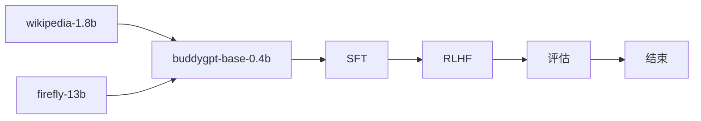
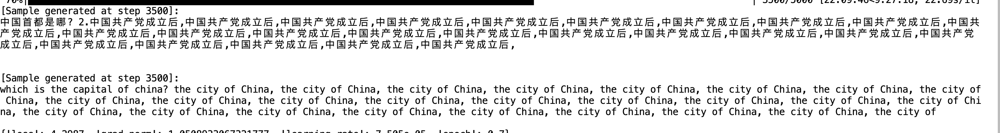
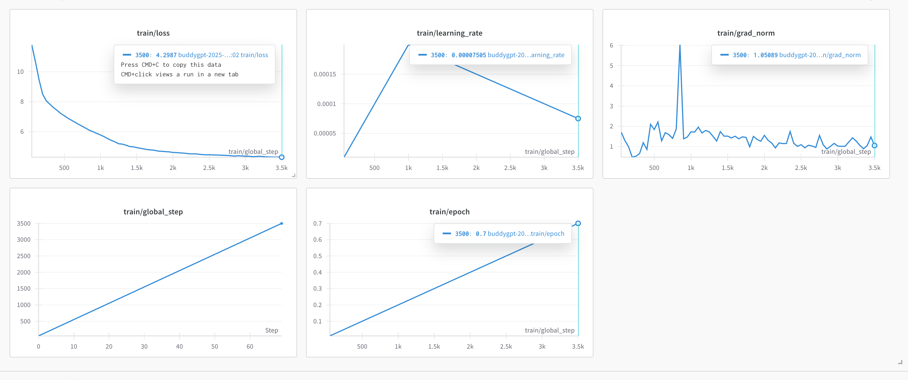

## buddygpt

> *train llm from scratch especially for the chinese language*
> with RoPE, GQA, SWiGLU, RMSNorm, weight-tying, FLASH-ATTENTION

|model|Tied Embedding|RoPE|Q-head|KV-head|n_embed|n_layer|seq_len|loss|
|-|-|-|-|-|-|-|-|-|
|buddygpt-0.1b|✅|✅|16|8|768|4|1024|4.2111|
|buddygpt-0.2b|✅|✅|16|8|512|24|1024|4.6754|
|buddygpt-0.4b|✅|✅|16|8|**1024**|**32**|1024|3.6754|


## implementation



## pretrain
#### dataset
本次训练的预训练预料都来自[Hugging Face](https://huggingface.co/)，主要包含以下几个经典的中文数据集，大约有35B左右Token，详细数据集如下：

| 中文预训练语料    | 链接                                                         | 描述                                            |
| ----------------- | ------------------------------------------------------------ | ----------------------------------------------- |
| Wiki中文百科      | [wikipedia](https://huggingface.co/datasets/pleisto/wikipedia-cn-20230720-filtered) | 中文Wikipedia的数据(1.8B)  |
| zhihu             | [zhihu](https://huggingface.co/datasets/wangrui6/Zhihu-KOL)  | 知乎KOL中截取的数据(0.47B)          |
| 网络小说      | [webnovel](https://huggingface.co/datasets/wdndev/webnovel-chinese) | 网络小说(8.4B)                             |
| fineweb-sample-10B | [fineweb-sample10TB](https://huggingface.co/datasets/HuggingFaceFW/fineweb) | sample-10BT: a subset randomly sampled from the whole dataset of around 10B gpt2 tokens (10B) |
| Ultra-FineWeb | [Ultra-FineWeb](https://huggingface.co/datasets/openbmb/Ultra-FineWeb) | Ultra-FineWeb is a large-scale, high-quality, and efficiently-filtered dataset(120B) |
| Firefly pretrain | [firefly-pretrain](https://huggingface.co/datasets/YeungNLP/firefly-pretrain-dataset) | Firefly 模型训练的部分中文数据(4.7B) |

#### summary

- buddygpt-0.1b-base-zh


- buddygpt-0.2b-base-zh

- buddygpt-0.4b-base-zh


 可以看到开始有北京了，这时候loss=3.8
 
#### metrics
|model|cmmlu@0|cmmlu@5|gpqa|ifeval|aime24|math-500|livecodebench|
|-|-|-|-|-|-|-|-|
|[buddygpt-0.2b-base-zh](https://huggingface.co/learn2pro/buddygpt-0.2b-base-zh)|*25.47*|*25.47*|0.1|0.1|0.1|0.1|0.1|
|[buddygpt-0.2b-chat-zh](https://huggingface.co/learn2pro/buddygpt-0.2b-chat-zh)|*25.08*|*25.10*|0.1|0.1|0.1|0.1|0.1|
|[buddygpt-0.2b-dpo-zh](https://huggingface.co/learn2pro/buddygpt-0.2b-chat-zh)|*25.08*|*25.85*|0.1|0.1|0.1|0.1|0.1|
|deepseek-v3|**88.8**|**88.8**|59.1|**86.1**|39.2|**90.2**|37.6|
|qwen3-0.6b|35.29|32.88|-|-|-|32.44|-|
|qwen2.5-0.5b|41.44|39.23|-|-|-|32.44|-|


## SFT

SFT指令微调预料都来自[Hugging Face](https://huggingface.co/)，主要包含以下几个经典的SFT数据集，大约有400w条，详细数据集如下：

| SFT微调数据 | 链接                                                         | 描述                                       |
| ----------- | ------------------------------------------------------------ | ------------------------------------------ |
| Mxode/Chinese-Instruct-Lite |[Mxode/Chinese-Instruct-Lite](https://huggingface.co/datasets/Mxode/Chinese-Instruct-Lite/viewer/general) | 一个全新的简化数据集 |
| Belle       | [Belle](https://huggingface.co/datasets/BelleGroup/train_2M_CN) | 包含约200万条由BELLE项目生成的中文指令数据 |
| Firefly     | [Firefly](https://huggingface.co/datasets/YeungNLP/firefly-train-1.1M) | 流萤开源模型SFT数据集                      |
| TigerBot    | [tigerBot](https://huggingface.co/datasets/TigerResearch/sft_zh) | TigerBot 模型SFT数据集                     |
| YeungNLP/moss-003-sft-data |[YeungNLP/moss-003-sft-data](https://huggingface.co/datasets/YeungNLP/moss-003-sft-data)|YeungNLP|


## RLHF

来源于开源DPO数据集，详细数据集如下：

| DPO微调数据 | 链接                                                         | 描述                                       |
| ----------- | ------------------------------------------------------------ | ------------------------------------------ |
| FuseAI/FuseChat-3.0-DPO-Data       | [FuseAI/FuseChat-3.0-DPO-Data](https://huggingface.co/datasets/FuseAI/FuseChat-3.0-DPO-Data/viewer/default/train?row=0&views%5B%5D=train) | 包含约200万条由BELLE项目生成的中文指令数据 |
| Hello-SimpleAI/HC3-Chinese     | [Hello-SimpleAI/HC3-Chinese](https://huggingface.co/datasets/Hello-SimpleAI/HC3-Chinese) | 流萤开源模型SFT数据集                      |
|YeungNLP/ultrafeedback_binarized|[YeungNLP/ultrafeedback_binarized](https://huggingface.co/datasets/YeungNLP/ultrafeedback_binarized)|YeungNLP DPO|

## code structure

- model: the model structure code
- pretrain: pretrain workflow
- sft: finetune workflow
- rlhf: rlhf with DPO https://arxiv.org/pdf/2305.18290
- eval: evaluate tool with [lm-eval](https://github.com/EleutherAI/lm-evaluation-harness)

## script

- pretrain: 
```
cd pretrain && accelerate launch --config_file ptrain.yaml --num_processes=1 pretrain.py
```
- eval: 
```shell
export PYTHONPATH=$(pwd):$PYTHONPATH
lm_eval --model hf \
    --model_args pretrained=learn2pro/buddygpt-0.4b-base-zh,dtype="bfloat16" \
    --tasks cmmlu,gpqa \
    --device cuda:0 \
    --batch_size 8 \
    --num_fewshot 2 \
    --output_path results/cmmlu_2shot_log \
    --log_samples

lm_eval --model hf \
    --model_args pretrained=learn2pro/buddygpt-0.4b-base-zh,dtype="bfloat16" \
    --tasks cmmlu \
    --device cuda:0 \
    --batch_size 8 \
    --num_fewshot 2 \
    --output_path results/cmmlu_2shot_log \
    --log_samples


lm_eval --model hf \
    --model_args pretrained=outputs/buddysft-qwen3,dtype="bfloat16" \
    --tasks cmmlu \
    --device cuda:0 \
    --batch_size 8

lm_eval --model hf \
    --model_args pretrained=qwen/qwen3-0.6b,dtype="bfloat16" \
    --tasks cmmlu \
    --device cuda:0 \
    --batch_size 32

all_proxy= evalscope eval \
 --model outputs/buddygpt-qwen3 \
 --model-args precision=torch.bfloat16,device_map=auto \
 --datasets cmmlu

all_proxy= evalscope eval \
 --model outputs/checkpoint-22614 \
 --datasets cmmlu \
 --limit 10
```

- serve by transformer
```
transformers chat learn2pro/buddygpt-0.1b-chat
```

- push_to_hub:
```
huggingface-cli login
huggingface-cli repo create buddygpt-0.1b-chat --type model
huggingface-cli upload learn2pro/buddygpt-0.1b-chat .
```

- push to modelscope:
```
modelscope login
all_proxy= modelscope modelcard -act create -mid learn2pro/buddygpt-0.2b-chat-zh -ch learn2pro/buddygpt-0.2b-chat-zh
all_proxy= modelscope upload learn2pro/buddygpt-0.2b-chat-zh .
```


